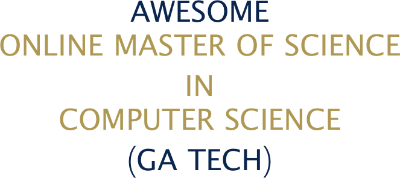

> Resources on admission, and how to succeed for the Online Master of Science in Computer Science program of the Georgia Institute of Technology.

We encourage [contributions](./CONTRIBUTING.md). Please read the guidelines including the [code of conduct](./CODE-OF-CONDUCT.md). If you are enrolled at Georgia Tech, please follow the University's rules.

**Disclaimer: we do not guarantee that all of the information on this page are reliable. You have to read through the official website's FAQ first.**

## Table of Contents

<!-- toc -->
- [Admission Resources](#admission-resources)
  - [Official Resources for Admission](#official-resources-for-admission)
  - [Unofficial Resources for Admission](#unofficial-resources-for-admission)
- [Computer Science Courses & Resources](#computer-science-courses--resources)
  - [Introduction to Computer Science](#introduction-to-computer-science)
  - [Mathematics for Computer Science](#mathematics-for-computer-science)
  - [Open Source Computer Science Education](#open-source-computer-science-education)
- [Post-admission Resources](#post-admission-resources)
  - [Official guides and resources](#official-guides-and-resources)
  - [Unofficial guides and resources](#unofficial-guides-and-resources)
- [Resources for International Applicants](#resources-for-international-applicants)
  - [TOEFL](#toefl)
- [Georgia Institute of Technology General Info](#georgia-institute-of-technology-general-info)
  - [History](#history)
  - [Rank](#rank)
  - [Songs](#songs)
- [Social Media](#social-media)
  - [Reddit](#reddit)
  - [Google Plus](#google-plus)
  - [Facebook](#facebook)
  - [Twitter](#twitter)
  - [Slack](#slack)
<!-- tocstop -->

## Admission Resources

### Official Resources for Admission

- [Official OMS CS FAQ](http://www.omscs.gatech.edu/prospective-students/faq)
- [Academic Calendar](https://career.gatech.edu/sites/default/files/documents/co-op_calendar_2017-2018.pdf)
- [Costs and Payment Schedule](http://www.omscs.gatech.edu/program-info/cost-payment-schedule)
- [Application Deadlines, Process and Requirements](https://www.omscs.gatech.edu/program-info/application-deadlines-process-requirements)
- [Minimum TOEFL score: 100](http://www.omscs.gatech.edu/prospective-students/faq)

### Unofficial Resources for Admission

- [GPA Calculator](https://applications.wes.org/igpa-calculator/)
- [Minimum number of recommendation letters: 2](https://www.reddit.com/r/OMSCS/comments/2emm9g/how_many_letters_of_recommendation/)

## Computer Science Courses & Resources

> [There are reports of Information Technology graduates rejected by Georgia Tech. This is primarily because Information Technology does not have the same courses as Computer Science. If you are struggling to go back to school, the University might recognize some MOOC certificates.](https://plus.google.com/u/0/101818942608826178101/posts/CcMMURwzFB5?cfem=1)

### Introduction to Computer Science

- [Harvard's CS50](https://www.edx.org/course/cs50s-introduction-computer-science-harvardx-cs50x)

### Mathematics for Computer Science

- [Shanghai Jiao Tong University's Discrete Mathematics](https://www.coursera.org/learn/discrete-mathematics)

### Open Source Computer Science Education

- [Open Source Society University](https://github.com/ossu/computer-science)
- [MIT Challenge](https://www.scotthyoung.com/blog/myprojects/mit-challenge-2)
- [How to get an equivalent of a CS major using MOOCs](https://backdoorgraduteschooladmissions.quora.com/How-to-get-an-equivalent-of-a-CS-major-using-MOOCs)

## Post-admission Resources

### Official guides and resources

- [OMS CS Onboarding](http://www.omscs.gatech.edu/online-ms-cs/omscsportal/onboarding)
- [Specializations](https://www.omscs.gatech.edu/program-info/specializations)
- [OMS CS Newsletter](https://www.omscs.gatech.edu/current-students/newsletter)
- [Buzzport](https://buzzport.gatech.edu)
- [Student Handbook](http://grad.gatech.edu/student-handbook)

### Unofficial guides and resources

- [How to Succeed in OMSCS](http://omscs.wikidot.com)
- [OMSCental](https://omscentral.com)
- [OMSCS Survival Guide](https://github.com/pyjarrett/OMSCS_Survival_Guide)

## Resources for International Applicants

### TOEFL

- [TOEFL iBT](https://www.ets.org/toefl/ibt/about)
- [Official TOEFL Practice Test](http://toeflpractice.ets.org)

## Georgia Institute of Technology General Info

### History

- [History and Traditions](http://www.gatech.edu/about/history-traditions)

### Rank

- [Top 6 in Computer Science - United States](https://www.usnews.com/best-colleges/georgia-tech-1569/overall-rankings)
- [QS World University Rankings 2018: Statistics - Top 7 Worldwide](https://www.theguardian.com/higher-education-network/2018/feb/28/qs-world-university-rankings-2018-statistics)

### Songs

- [Ramblin' Wreck](https://www.youtube.com/watch?v=O6JXKMxRgQ8)
- [The History of Ramblin' Wreck](https://www.youtube.com/watch?v=6CjryQmz8GM)

## Social Media

### Reddit

- [Reddit OMSCS](https://www.reddit.com/r/OMSCS/)

### Google Plus

- [Google Plus - Georgia Tech OMSCS](https://plus.google.com/communities/108902554607547634726)

### Facebook

- [OMSCS Students](https://www.facebook.com/groups/gtomscsstudents)

### Twitter

- [GA Tech OMS CS](https://twitter.com/gtomscs)

### Slack

- [OMS CS Study Group](https://omscs-study.slack.com)
